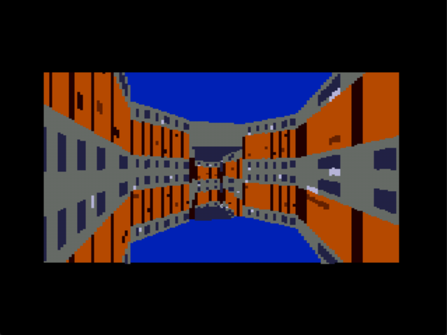

An in-progress 3d graphics engine for the Sega Megadrive.
 
Uses a doom-style BSP graphics pipeline. For more information, look at graphics_pipeline.txt

There are a couple binaries to play around with in /bin (run them in a Genesis/Megadrive emulator)

